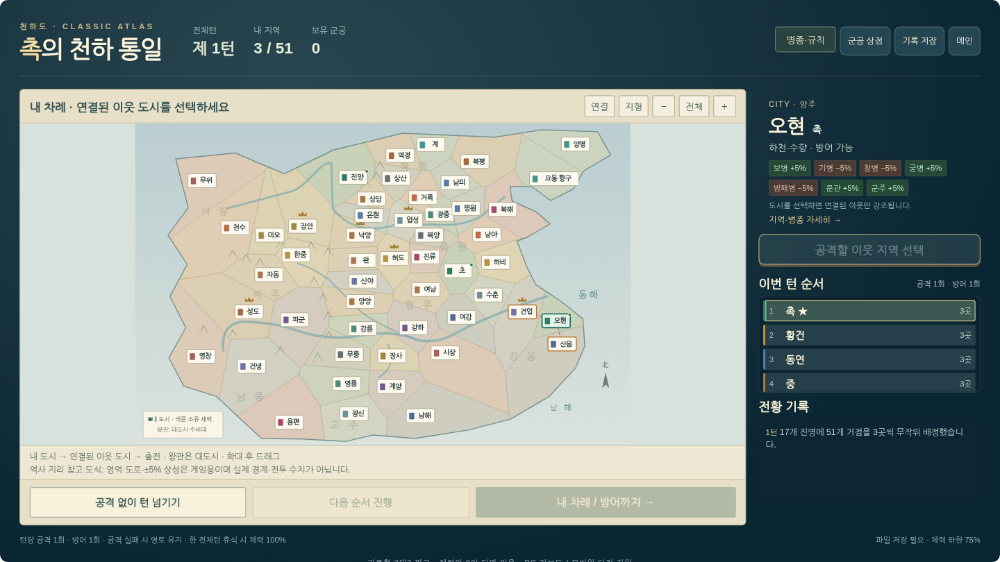

# 삼국지 피구대전 — 천하도 v9

**17개 진영 · 99명 장수 · 51개 점령 거점 · 가로형 3대3 피구**

브라우저에서 실행하는 삼국지 테마 피구 게임입니다. 단판 경기, 군웅 제패전, 지도 점령전을 지원합니다. 이 저장소용 패키지는 **기존 v9의 게임 코드를 변경하지 않고** 진입 파일을 `index.html`로 정리한 버전입니다.



## 시작하기

로컬에서는 `index.html`을 브라우저로 엽니다. 웹 배포에는 **GitHub Pages → main → /(root)**를 사용합니다. 별도의 빌드 명령, npm 설치, API 키, 서버 프로그램은 필요하지 않습니다. 게임의 그림·음향·스타일·로직은 모두 `index.html` 안에 있습니다.

게임이 공개된 후 실제 플레이 주소는 저장소 **Settings → Pages → Visit site**에서 확인합니다. 일반 프로젝트 사이트 주소 형식은 다음과 같습니다. 아래는 예시이며 실제 배포 주소가 아닙니다.[1]

```text
https://YOUR_GITHUB_ID.github.io/samguk-dodgeball/
```

## GitHub에 올리기

1. ZIP을 풀고 `samguk-dodgeball` 폴더를 엽니다.
2. GitHub에 저장소를 만들고 **Add file → Upload files**로 폴더 **안의 파일과 하위 폴더**를 올립니다. ZIP 자체나 바깥 `samguk-dodgeball` 폴더를 한 단계 더 넣지 않습니다.[2]
3. 저장소 첫 화면에 `index.html`이 보이는지 확인한 뒤 변경을 커밋합니다. 진입 파일은 배포 폴더 최상위에 있어야 합니다.[3]
4. **Settings → Pages**에서 `Deploy from a branch`, `main`, `/(root)`를 선택하고 **Save**를 누릅니다. 이 패키지는 사용자 정의 Actions 워크플로를 사용하지 않습니다.[4]
5. 배포가 성공하면 같은 화면의 **Visit site**로 실행합니다.[3]

무료 개인 계정으로 배포할 때는 공개(Public) 저장소를 사용합니다. 사이트에 개인정보, 계정 비밀번호, 개인 저장 파일을 올리지 마세요.[3]

**[그림 없이 따라 하는 상세 배포 안내](docs/GITHUB_PAGES_SETUP.md)**

## 조작

| 기능 | 키보드 |
|---|---|
| 이동 | 방향키 / WASD |
| 일반 투구 / 잡기 / 회피 | J / K / L |
| 특징 기술 / 필살기 | E / R |
| 교대·패스 / 장수 직접 선택 | Q / 1·2·3 |
| 일시정지 / 전체 화면 | P / F |

휴대폰·태블릿은 가로 화면의 조이스틱과 버튼을 사용합니다. 게임의 전체 규칙과 점령전 설명은 [게임 사용 안내](docs/GAME_GUIDE.md)에 있습니다.

## 포함한 게임 기능

출전 장수 3명 선택, 홈·어웨이, 7종 병종과 지역 특성, 체력·기 게이지, 장수별 특징 기술·필살기, 벽 반사와 무해한 데드볼, 필살기 잡기 충격, 군공 상점의 1~2경기용 아이템을 포함합니다.

점령전은 무작위 초기 소유권·턴 순서, 인접 거점 공격, 전체턴 내 공격·방어 제한, 공격 실패 시 영토 유지, 멸망 알림, 장수별 체력과 휴식 회복, 대도시 지원병을 지원합니다. 지도와 병종 수치는 역사적 행정구역·전투 통계의 복원이 아닌 게임 설정입니다.

## 기존 플레이 기록 옮기기

기존 v9에서 **기록 → 기록 파일 내보내기**로 JSON 파일을 보관한 뒤, 배포한 게임에서 **기록 → 기록 파일 불러오기**로 불러옵니다. 점령전 지도에서는 **기록 저장**으로 내보낼 수도 있습니다.

브라우저 저장소는 접속 출처(origin)에 따라 구분되므로 로컬 HTML에서 쓰던 기록이 새 웹 주소에 자동으로 따라오지는 않습니다. 브라우저 데이터 삭제·기기 교체·주소 변경 전에는 기록을 따로 보관하세요.[5]

이 게임에 계정 로그인이나 클라우드 동기화는 없습니다. `.gitignore`는 개인 저장 파일의 Git 추가를 줄이기 위한 것이며, 웹 업로드 화면에서는 올릴 파일을 직접 확인해야 합니다.

## 폴더 구조

```text
samguk-dodgeball/
├── index.html                    # 실제 게임, 원본 v9와 동일
├── README.md                     # 저장소 소개와 빠른 실행
├── .nojekyll                     # 정적 파일 배포 설정
├── .gitignore                    # 개인 기록·임시 파일 제외
├── .gitattributes                # 텍스트 줄바꿈 설정
├── package-info.json             # 패키지 버전·원본 해시
├── assets/screenshots/           # README용 실제 게임 화면
├── data/                         # 지도·장수·도시 참고 자료
├── docs/                         # 배포·플레이·개발·검증 안내
└── tools/check_package.py        # 선택 사항: 패키지 검사
```

**`data/`는 참고용 사본입니다.** 현재 게임은 `index.html` 안에 포함된 데이터를 사용합니다. `data/world-v9.json`만 수정해도 게임이 바뀌지는 않습니다. `assets/`의 이미지는 문서용이며 게임 실행에 필수인 외부 이미지가 아닙니다.

## 로컬 개발과 업데이트

Python이 설치된 환경에서 HTTP 실행을 시험하려면 저장소 폴더에서 다음 명령을 사용합니다. 이 서버는 로컬 확인용이며 GitHub Pages 운영에 필요하지 않습니다.

```bash
python -m http.server 8000 --bind 127.0.0.1
```

브라우저에서 `http://127.0.0.1:8000/`을 엽니다. 게임을 업데이트할 때는 새 HTML을 `index.html`로 교체하고 `main`에 반영합니다. 동일 파일·경로를 유지하되, 저장 형식이 바뀌는 업데이트 전에는 기록을 백업하세요. 브랜치 배포는 설정한 배포 원본의 변경 사항을 반영합니다.[4]

선택적 패키지 검사:

```bash
python tools/check_package.py
```

Python 표준 라이브러리만 사용하며, Node.js가 설치되어 있으면 인라인 JavaScript 문법도 검사합니다. 이는 전체 게임 플레이 테스트를 대신하지 않습니다.

## 안내 문서

[배포 안내](docs/GITHUB_PAGES_SETUP.md) · [게임 사용 안내](docs/GAME_GUIDE.md) · [개발·업데이트 메모](docs/PROJECT_NOTES.md) · [이번 패키지 확인 기록](docs/PACKAGE_CHECKS.md)

[장수별 병종](data/officer-classes-v9.txt) · [도시별 특성](data/city-terrain-v9.txt) · [역사·지리 참고 자료](docs/HISTORICAL_SOURCES.txt)

라이선스는 이 패키징 과정에서 임의로 지정하지 않았습니다. 배포자가 사용할 라이선스를 결정한 경우 별도 `LICENSE` 파일을 추가하세요. 글꼴 파일과 개인 플레이 기록은 패키지에 포함하지 않았습니다.

## 배포·저장 방식 참고

[1]: https://docs.github.com/en/pages/getting-started-with-github-pages/what-is-github-pages
[2]: https://docs.github.com/en/repositories/working-with-files/managing-files/adding-a-file-to-a-repository
[3]: https://docs.github.com/en/pages/getting-started-with-github-pages/creating-a-github-pages-site
[4]: https://docs.github.com/en/pages/getting-started-with-github-pages/configuring-a-publishing-source-for-your-github-pages-site
[5]: https://developer.mozilla.org/en-US/docs/Web/API/Window/localStorage
